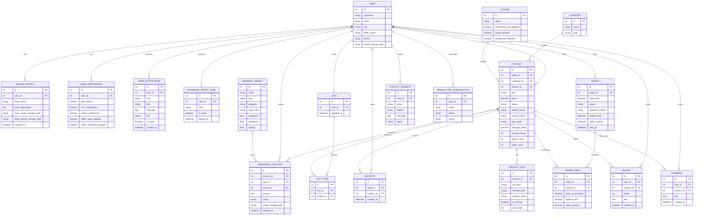

# Meshio ER Diagram

```mermaid
erDiagram
  USER {
    int id PK
    string username
    string email
    string role
    string seller_status
    string phone
    string avatar_storage_path
  }

  SELLER_PROFILE {
    int id PK
    int user_id FK
    string store_name
    text store_description
    string store_avatar_storage_path
    string store_banner_storage_path
    datetime created_at
  }

  USER_PREFERENCE {
    int id PK
    int user_id FK
    boolean dark_theme
    boolean sms_notifications
    boolean search_preferences
    boolean seller_sales_updates
    boolean seller_comments_updates
  }

  USER_NOTIFICATION {
    int id PK
    int user_id FK
    string kind
    string title
    text message
    string link
    boolean is_read
    datetime created_at
  }

  PASSWORD_RESET_CODE {
    int id PK
    int user_id FK
    string code
    boolean is_used
    datetime expires_at
  }

  CATEGORY {
    int id PK
    string name
    string slug
  }

  LICENSE {
    int id PK
    string name
    boolean commercial_use_allowed
    boolean resale_allowed
    boolean modification_allowed
  }

  PRODUCT {
    int id PK
    int seller_id FK
    int category_id FK
    int license_id FK
    string title
    decimal price
    string status
    string model_format
    string viewer_format
    string poly_style
    decimal average_rating
    int reviews_count
    int views_count
    int sales_count
  }

  PRODUCT_FILE {
    int id PK
    int product_id FK
    string file_type
    string storage_path
    string original_name
    boolean is_primary
    int sort_order
  }

  MATERIAL_PRESET {
    int id PK
    string name
    string slug
    string category
    string base_color
    float roughness
    float metalness
    float opacity
  }

  GENERATED_TEXTURE {
    int id PK
    int product_id FK
    int user_id FK
    int preset_id FK
    text prompt
    string status
    string image_storage_path
    datetime created_at
  }

  CART {
    int id PK
    int user_id FK
    datetime updated_at
  }

  CART_ITEM {
    int id PK
    int cart_id FK
    int product_id FK
  }

  FAVORITE {
    int id PK
    int user_id FK
    int product_id FK
    datetime created_at
  }

  ORDER {
    int id PK
    int buyer_id FK
    decimal total_price
    string status
    string payment_method
    decimal platform_fee
    decimal seller_amount
    datetime paid_at
  }

  ORDER_ITEM {
    int id PK
    int order_id FK
    int product_id FK
    decimal price_at_purchase
    decimal platform_fee
    decimal seller_amount
  }

  REVIEW {
    int id PK
    int user_id FK
    int product_id FK
    int rating
    text text
    datetime created_at
  }

  COMMENT {
    int id PK
    int user_id FK
    int product_id FK
    text text
    datetime created_at
  }

  CONTACT_REQUEST {
    int id PK
    int user_id FK
    string email
    string subject
    text message
    string status
  }

  NEWSLETTER_SUBSCRIPTION {
    int id PK
    int user_id FK
    string email
    string status
    string source
  }

  USER ||--o| SELLER_PROFILE : has
  USER ||--o| USER_PREFERENCE : has
  USER ||--o{ USER_NOTIFICATION : receives
  USER ||--o{ PASSWORD_RESET_CODE : requests
  USER ||--o{ PRODUCT : sells
  CATEGORY ||--o{ PRODUCT : groups
  LICENSE ||--o{ PRODUCT : applies
  PRODUCT ||--o{ PRODUCT_FILE : has
  PRODUCT ||--o{ GENERATED_TEXTURE : receives
  USER ||--o{ GENERATED_TEXTURE : creates
  MATERIAL_PRESET ||--o{ GENERATED_TEXTURE : uses
  USER ||--o| CART : owns
  CART ||--o{ CART_ITEM : contains
  PRODUCT ||--o{ CART_ITEM : selected
  USER ||--o{ FAVORITE : saves
  PRODUCT ||--o{ FAVORITE : saved
  USER ||--o{ ORDER : buys
  ORDER ||--o{ ORDER_ITEM : includes
  PRODUCT ||--o{ ORDER_ITEM : purchased
  USER ||--o{ REVIEW : writes
  PRODUCT ||--o{ REVIEW : rated
  USER ||--o{ COMMENT : writes
  PRODUCT ||--o{ COMMENT : discussed
  USER ||--o{ CONTACT_REQUEST : sends
  USER ||--o{ NEWSLETTER_SUBSCRIPTION : subscribes
```
